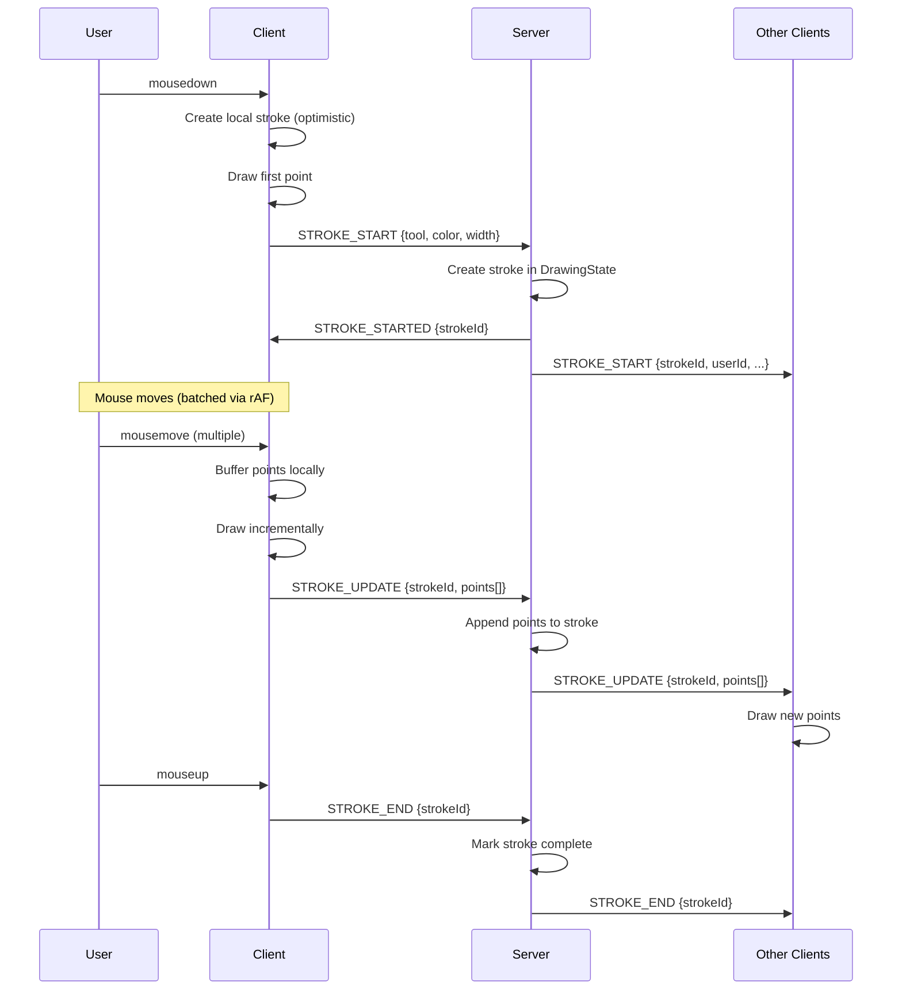

# Architecture Documentation

This document explains the technical design of the Collaborative Canvas application for senior engineers or interview walkthrough.

## Table of Contents

1. [System Overview](#system-overview)
2. [Data Flow](#data-flow)
3. [WebSocket Protocol](#websocket-protocol)
4. [Operations Model & Undo/Redo](#operations-model--undoredo)
5. [Performance Decisions](#performance-decisions)
6. [Trade-offs & Future Improvements](#trade-offs--future-improvements)

---

## System Overview

```
┌─────────────────────────────────────────────────────────────────┐
│                         Browser (Client)                         │
├─────────────┬──────────────────┬──────────────┬─────────────────┤
│ canvasManager│   socketClient   │   toolbar    │    userList     │
│ (input/draw) │   (WebSocket)    │    (UI)      │     (UI)        │
└──────┬───────┴────────┬─────────┴──────────────┴─────────────────┘
       │                │
       │                │ WebSocket (Socket.io)
       │                │
┌──────▼────────────────▼──────────────────────────────────────────┐
│                         Node.js Server                            │
├─────────────┬──────────────────┬─────────────────────────────────┤
│  server.ts  │  socketHandlers  │      drawingState + rooms       │
│  (bootstrap)│  (event routing) │      (state management)         │
└─────────────┴──────────────────┴─────────────────────────────────┘
```

### Core Principles

1. **Server is authoritative** - All state mutations happen server-side
2. **Optimistic rendering** - Client draws locally before server confirmation
3. **Operation-based** - Changes are operations, not state diffs
4. **Append-only** - Undo/redo append new ops, never delete

---

## Data Flow

### Drawing a Stroke (Happy Path)



### Key Timing Observations

1. **Sub-100ms perceived latency** - Local drawing happens immediately
2. **Network-independent UX** - Even with 500ms RTT, user sees their drawing instantly
3. **Eventual consistency** - Other users see stroking ~50-150ms delayed (acceptable for drawing)

---

## WebSocket Protocol

| Event | Direction | Payload | Purpose |
|-------|-----------|---------|---------|
| `JOIN_ROOM` | C→S | `{roomId, userName}` | Join drawing room |
| `SYNC_STATE` | S→C | `{userId, users[], strokes[]}` | Initial state on join |
| `USER_JOINED` | S→C (broadcast) | `{user}` | New user notification |
| `USER_LEFT` | S→C (broadcast) | `{userId}` | User left notification |
| `CURSOR_MOVE` | C→S→C | `{userId, x, y}` | Cursor position |
| `STROKE_START` | C→S | `{tool, color, width}` | Begin stroke |
| `STROKE_STARTED` | S→C | `{strokeId}` | Confirm stroke with ID |
| `STROKE_START` | S→C (broadcast) | `{strokeId, userId, ...}` | Notify others |
| `STROKE_UPDATE` | C→S→C | `{strokeId, points[]}` | Point batch |
| `STROKE_END` | C→S→C | `{strokeId}` | End stroke |
| `UNDO` | C→S→C | `{targetStrokeId?}` | Undo request + visible strokes |
| `REDO` | C→S→C | `{targetUndoOpId?}` | Redo request + visible strokes |

### Why Split Stroke Events?

**Alternative**: Single `STROKE_COMPLETE` at mouseup with all points.

**Why we don't do this**:
- User A draws for 5 seconds
- User B sees nothing for 5 seconds, then sudden stroke appears
- This feels broken, not "real-time"

**Our approach**: Stream points while drawing
- User B sees stroke forming in real-time
- Latency hidden by continuous visual feedback

---

## Operations Model & Undo/Redo

### Data Structures

```typescript
// Stroke with all point data
type Stroke = {
  id: string;
  userId: string;
  tool: 'brush' | 'eraser';
  color: string;
  width: number;
  points: Point[];
  complete: boolean;
};

// Append-only operation log
type Operation =
  | { type: 'stroke'; strokeId: string; timestamp: number; userId: string }
  | { type: 'undo'; targetStrokeId: string; timestamp: number; userId: string; id: string }
  | { type: 'redo'; targetUndoOpId: string; timestamp: number; userId: string; id: string };
```

### Why Operation-Based Undo?

**Alternative: Stack-based undo**
```
undoStack = [S1, S2, S3]
User clicks undo → pop S3 → delete S3
```

**Problem**: Cross-user undo breaks this model.
- User A draws S1, User B draws S2
- User A undos their last (S1)
- S2 should remain! But stack pops S2.

**Our solution: Operation log**
```
operations = [stroke(S1), stroke(S2)]
User A clicks undo → find A's last stroke (S1) → append undo(S1)
operations = [stroke(S1), stroke(S2), undo(S1)]
```

- S1 is "hidden" but not deleted
- S2 remains visible
- Redo appends another operation to "cancel" the undo

### Visibility Calculation

```typescript
function isStrokeVisible(strokeId: string): boolean {
  let undoCount = 0;
  let redoCount = 0;
  
  for (const op of operations) {
    if (op.type === 'undo' && op.targetStrokeId === strokeId) {
      undoCount++;
    }
    if (op.type === 'redo' && matchesUndo(op, strokeId)) {
      redoCount++;
    }
  }
  
  return undoCount <= redoCount; // Visible if redos balance undos
}
```

### Race Condition: What if A and B undo simultaneously?

```
t=0: operations = [stroke(S1), stroke(S2)]
t=1: A sends undo(S1)
t=1: B sends undo(S2)
t=2: Server receives A's undo first → append undo(S1)
t=3: Server receives B's undo → append undo(S2)
Final: operations = [..., undo(S1), undo(S2)]
```

**No conflict**: Both undos are independent operations. Order doesn't affect final visibility state. 

This is why append-only logs with server-side ordering are conflict-free for this use case.

---

## Performance Decisions

### 1. requestAnimationFrame Throttling

**Problem**: Mouse can poll at 1000Hz (gaming mice).

**Solution**: Batch points per animation frame (~60Hz)

```typescript
function onMouseMove(e) {
  pendingPoints.push({ x: e.offsetX, y: e.offsetY, t: Date.now() });
  
  if (rafId === null) {
    rafId = requestAnimationFrame(() => {
      socket.emit('STROKE_UPDATE', { strokeId, points: pendingPoints });
      pendingPoints = [];
      rafId = null;
    });
  }
}
```

**Result**: 16x fewer network messages (1000Hz → 60Hz)

### 2. Incremental vs Full Redraw

| Scenario | Strategy | Why |
|----------|----------|-----|
| Drawing active stroke | Incremental | Only draw new points |
| Undo/redo | Full redraw | Visibility changed; simpler than tracking |
| New user joins | Full redraw | Need to render all strokes |
| Window resize | Full redraw | Canvas dimensions changed |

**Full redraw performance**: 1000 strokes × 100 points ≈ 50-100ms
- Acceptable for undo (not called every 16ms)

### 3. Cursor Layer Separation

Two overlapping canvas elements:
1. **Drawing canvas** - Strokes (rarely redrawn during cursor move)
2. **Cursor canvas** - User cursors (frequently updated)

**Why**: Moving cursor triggers redraw. Without separation, would redraw all strokes 60x/sec.

### 4. Scaling to 100+ Users

| Concern | Mitigation |
|---------|------------|
| Cursor updates flood | Throttle to 50ms per user |
| Stroke updates flood | rAF batching (60Hz max) |
| Broadcast amplification | Messages scoped to room |
| Memory growth | Cap operation log at ~500 ops |
| Stroke rendering | Could use canvas layers per user |

---

## Trade-offs & Future Improvements

### Current Trade-offs

| Decision | Trade-off | Justification |
|----------|-----------|---------------|
| Operation-based undo | More memory | Enables cross-user undo |
| Full redraw on undo | O(n) per undo | Simpler than tracking visibility |
| No persistence | Data lost on restart | Interview scope |
| Single room | No room selection | Interview scope |
| Canvas 2D | ~10k stroke limit | Sufficient for demo |

### Future Improvements

1. **Persistence**: Store operations in Redis or DB
2. **Room system**: URL-based room IDs (`/canvas/room-123`)
3. **Pressure sensitivity**: Add `pressure` to Point type
4. **Undo stack limit**: Drop old operations to cap memory
5. **WebGL rendering**: For 10k+ strokes
6. **Operational Transform**: If conflicts become an issue at scale

---

## Interview Walkthrough Tips

When explaining this system:

1. **Start with the data model**: "Strokes are operations, not pixels"
2. **Explain why streams**: "Users need to see drawing in progress"
3. **Demo the undo**: "User A can undo User B's stroke - show this"
4. **Address scaling**: "Here's how we'd handle 100+ users"
5. **Acknowledge limits**: "We'd add persistence for production"
